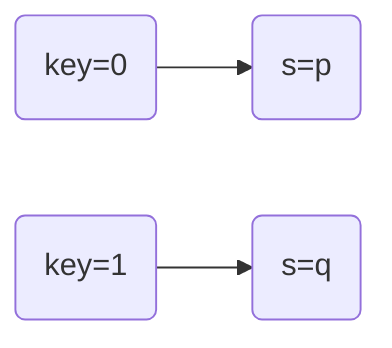

## Sumário

+ [[#Algebra booleana e relações lógicas]]
+ [[#Circuitos]]
+ [[#Icarus Verilog]]

---

## Algebra booleana e  relações lógicas

### Notação

<span style="color:rgba(255, 117, 127, 1)">NOT :</span>            $!$ ou  $\tilde{ }$  ou $'$
<span style="color:rgba(255, 117, 127, 1)">AND: </span>            $\&$ ou $\text{\\}$
<span style="color:rgba(255, 117, 127, 1)">OR :</span>               $|$ ou $+$

---
### Tabela  verdade

| **Termo** | **P** | **Q** | **~P** | **~Q** | **AND** | **OR** | **XOR** | **NAND** | **NOR** | **XNOR** |
| :-------: | :---: | :---: | :----: | :----: | :-----: | :----: | :-----: | :------: | :-----: | :------: |
|     0     |   0   |   0   |   1    |   1    |    0    |   0    |    0    |    1     |    1    |    1     |
|     1     |   1   |   0   |   0    |   1    |    0    |   1    |    1    |    1     |    0    |    0     |
|     2     |   0   |   1   |   1    |   0    |    0    |   1    |    1    |    1     |    0    |    0     |
|     3     |   1   |   1   |   0    |   0    |    1    |   1    |    0    |    0     |    0    |    1     |

+ **Mintermo** onde 1
+ **Maxtermo** onde 0

---
### Mintermos e Maxtermos
| **#** |   **Min**   |   **Max**   |
| :---: | :---------: | :---------: |
|   0   | ~x&~y&~z&~w |   x&y&z&w   |
|   1   | ~x&~y&~z&w  |  x&y&z&~w   |
|   2   | ~x&~y&z&~w  |  x&y&~z&w   |
|   3   |  ~x&~y&z&w  |  x&y&~z&~w  |
|   4   | ~x&y&~z&~w  |  x&~y&z&w   |
|   5   |  ~x&y&~z&w  |  x&~y&z&~w  |
|   6   |  ~x&y&z&~w  |  x&~y&~z&w  |
|   7   |  ~x&y&z&w   | x&~y&~z&~w  |
|   8   | x&~y&~z&~w  |  ~x&y&z&w   |
|   9   |  x&~y&~z&w  |  ~x&y&z&~w  |
|  10   |  x&~y&z&~w  |  ~x&y&~z&w  |
|  11   |  x&~y&z&w   | ~x&y&~z&~w  |
|  12   |  x&y&~z&~w  |  ~x&~y&z&w  |
|  13   |  x&y&~z&w   | ~x&~y&z&~w  |
|  14   |  x&y&z&~w   | ~x&~y&~z&w  |
|  15   |   x&y&z&w   | ~x&~y&~z&~w |

#### Soma dos produtos

O resultado de uma função lógica *f(w)* pode ser representada pela soma dos produtos *(SoP)* dos seu **mintermos**.

| **#** | **Mintermos** | **X** | **Y** | **f(w)** | **SoP** |
| :---: | :-----------: | :---: | :---: | :------: | :-----: |
|   0   |     ~x&~y     |   0   |   0   |    0     |    0    |
|   1   |     ~x&y      |   0   |   1   |    1     |    1    |
|   2   |     x&~y      |   1   |   0   |    1     |    1    |
|   3   |      x&y      |   1   |   1   |    0     |    0    |

**Mintermos = (1, 2) -> SoP = ( (~x&y) | (x&~y) )**

#### Produto das somas

O mesmo pode ser feito usando o produto das somas **(PoS)** de seus **maxtermos**

| **#** | **Maxtermos** | **X** | **Y** | **f(w)** | **SoP** |
| :---: | :-----------: | :---: | :---: | :------: | :-----: |
|   0   |      x&y      | 0     | 0     | 0        |    0    |
|   1   |     x&~y      | 0     | 1     | 1        |    1    |
|   2   |     ~x&y      | 1     | 0     | 1        |    1    |
|   3   |     ~x&~y     | 1     | 1     | 0        |    0    |

**Maxtermos = (0, 3) -> SoP = ( (X | Y) & (~X | ~Y) )**

---
### Visualização em uma matriz


$$
\text{AND}\;\;\;\;\;\;\;
\huge\begin{matrix}
 & \color{blue}0 & \color{blue}1 \\
\color{blue}0 & \color{red}0 & \color{red}0 \\
\color{blue}1 & \color{red}0 & \color{red}1
\end{matrix}
$$
$$
\text{OR}\;\;\;\;\;\;\;
\huge\begin{matrix}
  & \color{blue}0 & \color{blue}1 \\
\color{blue}0 & \color{red}0 & \color{red}1 \\
\color{blue}1 & \color{red}1 & \color{red}1 \\
\end{matrix}
$$


\* Valores de entrada em <span style="color:blue">azul</span> e valores de saída em <span style="color:red">vermelho</span>

| **P** | **Q** | **AND** | **OR** |
| :---: | :---: | :-----: | :----: |
|   0   |   0   |    0    |   0    |
|   1   |   0   |    0    |   1    |
|   0   |   1   |    0    |   1    |
|   1   |   1   |    1    |   1    |

---

### Relações

$\large\text{~(p\&q) = ~p|~q}$
$\large\text{~(p|q) =  ~p\&~q}$

$p\&p = p$
$p|p = p$

#### Elemento nulo e elemento neutro

$p\&0 = 0$   *(elemento nulo)*
$p\&1 = p$   *(elemento neutro)*

$p|0 = p$   *(elemento neutro)*
$p|1 = 0$   *(elemento nulo)*

#### Igualdades

$p|q = q|p$
$p \& q = q \& p$
##### P em evidência

$p \& (q|r) = (p\&q)|(p\&r)$
$p | (q\&r) = (p|q)\&(p|r)$
##### Ovo

$(p')' = p$ 
$p\&p' = 0$
$p|p' = 1$

#### Nand (NOT-AND)
$Nand(p\&p) == p'$

---
### Distância de Hamming /dH

Distância entre os bits na sequência.

00
01 <-- 1 bit de distância  
10 <-- 2 bits de distância

---
### Sequência de Gray
#### Espelho

$$
\begin{matrix}
00\\01\\10\\11\\
--\\
11\\01\\10\\00\\
\end{matrix}
$$

**Cilindro\****

$(x\;.\;y)+(x\;.\;y')$
$x\;.\;(y+y')$
$x$

Para encontrar o gray de um número use **XOR**:

| **B1** | **B2** | **B3** | **B4** |
| :----: | :----: | :----: | :----: |
|   0    |   0    |   1    |   0    |
|   0    | B1^B2  | B2^B3  | B3^B4  |
|   0    |   0    |   1    |   1    |

---
### Mapa de Veitch-Karnaugh

Usado para simplificar a montagem de uma operação lógica, o mapa de Veitch-Karnaugh é formado com as variáveis em forma de matrix, com os valores de entrada seguindo a sequência de Gray. 

Para usa-lo é necessário formar grupos, com o tamanho das potências de 2, com os valores adjacentes, o resultado é equivalente ao valores em comum dentro do grupo, usando tanto mintermos como maxtermos. No caso de que o grupo seja formado na diagonal o resultado é igual ao valor equivalente mais/vezes o XOR dos valores diferentes.


**Para três variáveis :**

$$
\begin{matrix}
\huge\text{ab\\c}\;\;\;0\;1\\
\huge\;\;\;00\;\;\;\;\color{lime}0\;1\\
\huge\;\;\;01\;\;\;\;\color{lime}2\;3\\
\huge\;\;\;11\;\;\;\;\color{lime}6\;7\\
\huge\;\;\;10\;\;\;\;\color{lime}4\;5\\
\end{matrix}
$$

**Para quatro variáveis :**

$$
\begin{matrix}
\huge\text{ab\\cd}\;\;\;00\;01\;11\;10\\
\huge\;\;\;00\;\;\;\;\;\color{lime}0\;\;\;1\;\;\;3\;\;\;2\\
\huge\;\;\;01\;\;\;\;\;\color{lime}4\;\;\;5\;\;\;7\;\;\;6\\
\huge\;\;\;\;11\;\;\;\;\;\color{lime}12\;13\;15\;14\\
\huge\;\;\;10\;\;\;\;\;\color{lime}8\;\;\;9\;\;11\;10\\
\end{matrix}
$$

#### Exemplos :

**Usando mintermos :** 

$$
\begin{matrix}
\huge\text{ab\\c}\;\;0\;1\\
\huge00\;\;\;\;\;\;\;\;\;\;\\
\huge01\;\;\;\;\color{lime}1\;\;1\\
\huge11\;\;\;\;\color{cyan}1\;\;1\\
\huge10\;\;\;\;\;\;\;\;\;\;
\end{matrix}
$$

*Soma dos Produtos\**

Grupo$_1$ (2,3) = $\color{lime}a'\;.\;b$
Grupo$_2$ (6,7) = $\color{cyan}a\;.\;b$

Resultado = ($\color{lime}a'\;.\;b \color{white}+ \color{cyan}a\;.b\;$) = $b\;\;.\;(a+a') = b$


**Usando maxtermos :**
$$
\begin{matrix}
\huge\text{ab\\c}\;0\;1\\
\huge01\;\;\;\;\color{lime}0\;\;0\\
\huge00\;\;\;\;\;\;\;\;\;\;\\
\huge11\;\;\;\;\;\;\;\;\;\;\\
\huge10\;\;\;\;\color{cyan}0\;\;0
\end{matrix}
$$
*Produto das Somas\**

**Em comum :** 

Grupo$_1$ (0,1)  = $\color{lime}a + b'$
Grupo$_2$ (4,5) = $\color{cyan}a' + b'$

Resultado = $(\color{lime}a + b'$ . $\color{cyan}a' + b'$$) =$ $b' + (a\; . \;a') = b'$

| ab\cd |         00         |               01                |               11                |       10        |
| :---: | :----------------: | :-----------------------------: | :-----------------------------: | :-------------: |
|  00   |  $\color{cyan}1$   | $\color{lime}1$/$\color{cyan}1$ | $\color{lime}1$/$\color{cyan}1$ | $\color{cyan}1$ |
|  01   |                    |                                 |                                 |                 |
|  11   | $\color{magenta}1$ |       $\color{magenta}1$        |                                 |                 |
|  10   |                    |         $\color{lime}1$         |         $\color{lime}1$         |        x        |

Grupo$_1$ (0,1,3,4) = $\color{cyan}a'\;.\;b'$
Grupo$_2$ (8,9) = $\color{magenta}a\;.\;b\;.\;c'$
Grupo$_3$ (1,3,13,15) = $\color{lime}b'\;.\;d$

**Resultado =** $\color{cyan}(a'\;.\;b')$ $+\;\color{magenta}(a\;.\;b\;.\;c')$ $+\;\color{lime}(b'\;.\;d)$ $\;= (b'\;.\;(a'+d))+(a\;.\;b\;.\;c')$

#### Visualização espacial

![[Teceract.excalidraw]]

### Quire-McCluskey

1. Formar grupos de acordo com a quantidade de 1 (<span style="color:cyan">mintermos</span>) ou 0 (<span style="color:lime">maxtermos</span>).
2. Formar grupos de **"pares"** com dH = 1.
3. Formar grupos de **"quadras"** com dH = 1.
+ No caso de grupos iguais escolha o que esta em ordem **crescente**.
+ Caso existam grupos demais fazer grupos de **"quadras"**.
4. Montar tabela com os **"pares"** sem grupo.
+ Considerar como **essenciais** aqueles que estão <span style="color:rgb(255,100,75)">sozinhos</span> na fileira.
5. **BATALHA NAVAL.**
6. Considerar grupos sobreviventes na batalha.
7. Montar expressão
+ SoP = (Essenciais) + (Sobreviventes)
+ PoS = (Essenciais) . (Sobreviventes)

#### Exemplo :

SoP(abcd) = (0,1,2,4,5,6,8,10,12,13,15)

| ab\cd | 00  | 01  | 11  | 10  |
| :---: | :-: | :-: | :-: | :-: |
|  00   |  1  |  1  |     |  1  |
|  01   |     |  1  |     |  1  |
|  11   |  1  |  1  |  1  |     |
|  10   |  1  |     |     |  1  |

1. **Formar grupos com  a quantidade de 1.**

|  0   |  1   |  2   |  3   |  4   |
| :--: | :--: | :--: | :--: | :--: |
| 0000 | 0001 | 0101 | 1101 | 1111 |
|      | 0010 | 0110 |      |      |
|      | 1000 | 1010 |      |      |
|      |      | 1100 |      |      |

2. **Formar grupo de "pares"**

*dH = 1*

|  (0,1)  | 000- | GA  |
| :-----: | :--: | :-: |
|  (0,2)  | 00-0 |  X  |
|  (0,8)  | -000 |  X  |
|  (1,5)  | 0-01 | GB  |
|  (2,6)  | 0-10 | GC  |
| (2,10)  | -010 |  X  |
| (8,10)  | 10-0 |  X  |
| (8,12)  | 10-0 | GD  |
| (5,13)  | -101 | GE  |
| (12,13) | 110- | GF  |
| (13,15) | 11-1 | GG  |

3. **Formar grupo de "Quadras"**

*dH = 1*

| ((0,8)(2,10)) | -0-0 | GH  |
| :-----------: | :--: | :-: |
| ((0,2)(8,10)) | -0-0 |  X  |

Como ((0,2)(8,10)) é **crescente** ele é removido.

4. **Montar tabela**

| Tabela |  0  |  1  |  2  |  5  |  6  |  8  | 10  | 12  | 13  | 15  |
| :----: | :-: | :-: | :-: | :-: | :-: | :-: | :-: | :-: | :-: | :-: |
|   GA   |  x  |  x  |     |     |     |     |     |     |     |     |
|   GB   |     |  x  |     |  x  |     |     |     |     |     |     |
|   GC   |     |     |  x  |     | *x* |     |     |     |     |     |
|   GD   |     |     |     |     |     |  x  |     |  x  |     |     |
|   GE   |     |     |     |  x  |     |     |     |     |  x  |     |
|   GF   |     |     |     |     |     |     |     |  x  |  x  |     |
|   GG   |     |     |     |     |     |     |     |     |  x  | *x* |
|   GH   |  x  |     |  x  |     |     |  x  | *x* |     |     |     |
|   #    |  2  |  2  |  2  |  2  | *1* |  2  | *1* |  2  |  3  | *1* |

**Guardar essenciais :**

SoP (GC+GG+GH)

 5. **Batalha naval?**

| Tabela |                      0                       |  1  |                      2                       |  5  |  6  |                      8                       | 10  | 12  |                      13                      | 15  |
| :----: | :------------------------------------------: | :-: | :------------------------------------------: | :-: | :-: | :------------------------------------------: | :-: | :-: | :------------------------------------------: | :-: |
|   GA   | <span style="color:rgb(255,70,100)">o</span> |  x  |                                              |     |     |                                              |     |     |                                              |     |
|   GB   |                      ^                       |  x  |                                              |  x  |     |                                              |     |     |                                              |     |
|   GC   |                      \|                      |     |                      x                       |     | *x* |                                              |     |     |                                              |     |
|   GD   |                      \|                      |     |                      \|                      |     |     | <span style="color:rgb(255,70,100)">o</span> |     |  x  |                                              |     |
|   GE   |                      \|                      |     |                      \|                      |  x  |     |                      ^                       |     |     | <span style="color:rgb(255,70,100)">o</span> |     |
|   GF   |                      \|                      |     |                      \|                      |     |     |                      \|                      |     |  x  | <span style="color:rgb(255,70,100)">o</span> |     |
|   GG   |                      \|                      |     |                      v                       |     |     |                      \|                      |     |     |                      x                       | *x* |
|   GH   |                      x                       |     | <span style="color:rgb(255,70,100)">o</span> |     |     |                      x                       | *x* |     |                                              |     |
|   #    |                      2                       |  2  |                      2                       |  2  | *1* |                      2                       | *1* |  2  |                      3                       | *1* |

5. **Batalha naval ... de novo?**

| Tabela |                      0                       |                      1                       |  2  |                      5                       |  6  |                      8                       | 10  |                      12                      |                      13                      | 15  |
| :----: | :------------------------------------------: | :------------------------------------------: | :-: | :------------------------------------------: | :-: | :------------------------------------------: | :-: | :------------------------------------------: | :------------------------------------------: | :-: |
|   GA   | <span style="color:rgb(255,70,100)">o</span> | <span style="color:rgb(255,70,100)">x</span> |     |                                              |     |                                              |     |                                              |                                              |     |
|   GB   |                                              |                     *x*                      |     | <span style="color:rgb(255,70,100)">x</span> |     |                                              |     |                                              |                                              |     |
|   GD   |                                              |                                              |     |                     v\|^                     |     | <span style="color:rgb(255,70,100)">o</span> |     | <span style="color:rgb(255,70,100)">x</span> |                                              |     |
|   GE   |                                              |                                              |     | <span style="color:rgb(255,70,100)">x</span> |     |                                              |     |                      ^                       | <span style="color:rgb(255,70,100)">o</span> |     |
|   GF   |                                              |                                              |     |                                              |     |                                              |     |                     *x*                      | <span style="color:rgb(255,70,100)">o</span> |     |
|   #    |                      1                       |                      2                       |  0  |                      2                       |  0  |                      1                       |  0  |                      2                       |                      2                       |  0  |

6. **Contribuições**

(**Essenciais**)+(<span style="color:lime">Sobreviventes</span>) = (**GC+GG+GH**)+(<span style="color:lime">GB+GF</span>)

7. **Montar expressão**

| 0-10 | GC  | a'cd' |
| :--: | :-: | ----- |
| 11-1 | GG  | abd   |
| -0-0 | GH  | b'd'  |
| 0-01 | GB  | a'c'd |
| 110- | GF  | abc'  |

SoP = (a'.c.d')+(a.b.d)+(b'.d')+(a'.c'.d')+(a.b.c')

#### Grupos no mapa

![[Mapa1.excalidraw]]

### Método de Reed-Müller

mapa com dH de 2.


---
## Circuitos

![[Circuits.excalidraw]]

### NAND & NOR

Usar apenas os gates <span style="color:cyan">NAND</span> ou <span style="color:cyan">NOR</span> é mais eficiente do que usar uma combinação de todos os gates, considerando que fisicamente falando ele são menores do que suas versões normais <span style="color:violet">(AND e OR)</span>, já que nela eles são basicamente feitos de seus respectivos gates mais um <span style="color:red">NOT</span>.

### Ponto flutuante

--

### Multiplexador

O multiplexador reflete o valor da chave.



![[Multiplexador.png]]

### Clock


---

## Icarus Verilog

+ **Tipo de arquivo :** ```.v
+ **Compilar :** ```iverilog -o arquivo.vvp arquivo.v
+ **Executar :** ```vvp arquivo.vvp ```

### Código

#### Introdução

```verilog
	module exemplo;

		reg x = 8'b00000101; // <- registro de 8 bits representado em binario

		initial   // <- Execução linear dentro do bloco
			begin : main

				$display ("%b(2) %d(10)", x, x);

			end   //   main 

	endmodule
```
